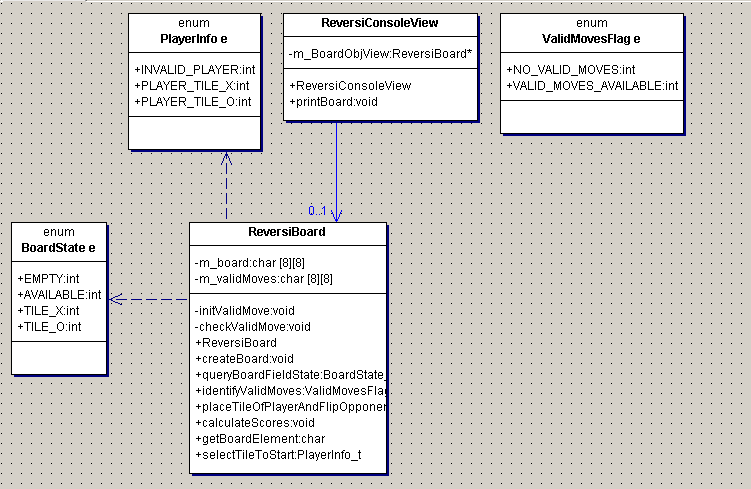

# Reversi Board Game devloped using C++11. 
## Objective
The aim of the project is to develop a console based version of the Reversi board game -[AboutReversi](https://en.wikipedia.org/wiki/Reversi).

## Working

* Model - View - Control Design pattern was used, Model is the ReversiBoard class, view is the ReversiConsoleView Class and Control is the ReversiBoard class.

find the uml of the board game below:

